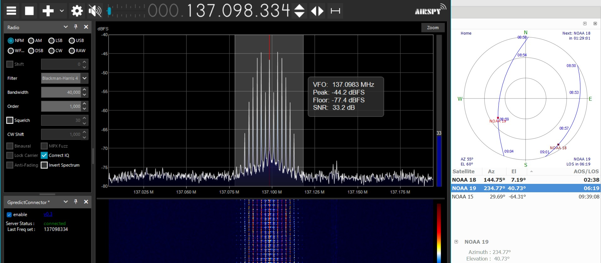

# tcasaniv-web

Repositorio del sitio web de [tcasaniv](https://www.github.com/tcasaniv).

Demo: <https://tcasaniv.github.io/tcasaniv-web>



## Tecnologías utilizadas

- Astro como el marco que une todo
- Solid.js para la búsqueda (todos los archivos `.tsx`) y cualquier otra función que requiera JavaScript
- Tailwind CSS para el estilo
- Fuse.js para la lógica de búsqueda

## Agradecimientos

- El Equipo de Astro y todos los demás autores del framework
- Los mantenedores de la plantilla [Astro blog template](https://github.com/withastro/astro/tree/latest/examples/blog?on=github) que se utilizó como base para este sitio

## 🚀 Estructura del proyecto

Dentro de tu proyecto Astro, verás las siguientes carpetas y archivos:

```txt
├── public/
├── src/
│   ├── components/
│   ├── content/
│   ├── layouts/
│   └── pages/
├── astro.config.mjs
├── README.md
├── package.json
└── tsconfig.json
```

Astro busca archivos `.astro` o `.md` en el directorio `src/pages/`. Cada página se expone como una ruta basada en su nombre de archivo.

No hay nada especial acerca de `src/components/`, pero ahí es donde nos gusta poner cualquier componente Astro/React/Vue/Svelte/Preact.

El directorio `src/content/` contiene «colecciones» de documentos Markdown y MDX relacionados. Usa `getCollection()` para recuperar posts de `src/content/blog/`, y comprueba el tipo de su frontmatter usando un esquema opcional. Consulta [Astro's Content Collections docs](https://docs.astro.build/en/guides/content-collections/) para obtener más información.

Cualquier activo estático, como imágenes, puede colocarse en el directorio `public/`.

## Comandos CLI

Todos los comandos se ejecutan desde la raíz del proyecto, desde un terminal:

| Commndo                | Acción                                                       |
| :--------------------- | :----------------------------------------------------------- |
| `npm install`          | Instala dependencias                                         |
| `npm run dev`          | Inicia el servidor de desarrollo local en `localhost:4321`.  |
| `npm run build`        | Construya su sitio de producción en `./dist/`.               |
| `npm run preview`      | Previsualice su compilación localmente, antes de desplegarla |
| `npm run astro ...`    | Ejecutar comandos CLI como `astro add`, `astro check`.       |
| `npm run astro --help` | Obtenga ayuda para utilizar Astro CLI                        |

### Más información sobre Astro

Consulta [la documentación](https://docs.astro.build) o entra en el [servidor Discord](https://astro.build/chat).
